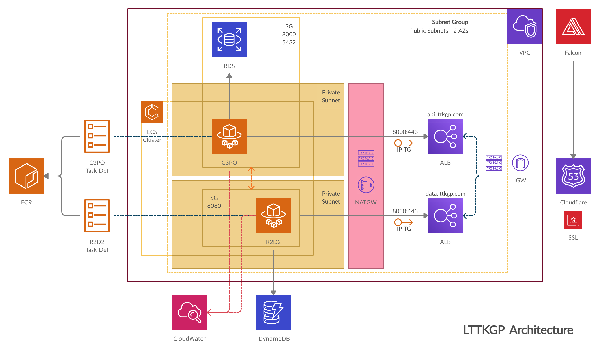
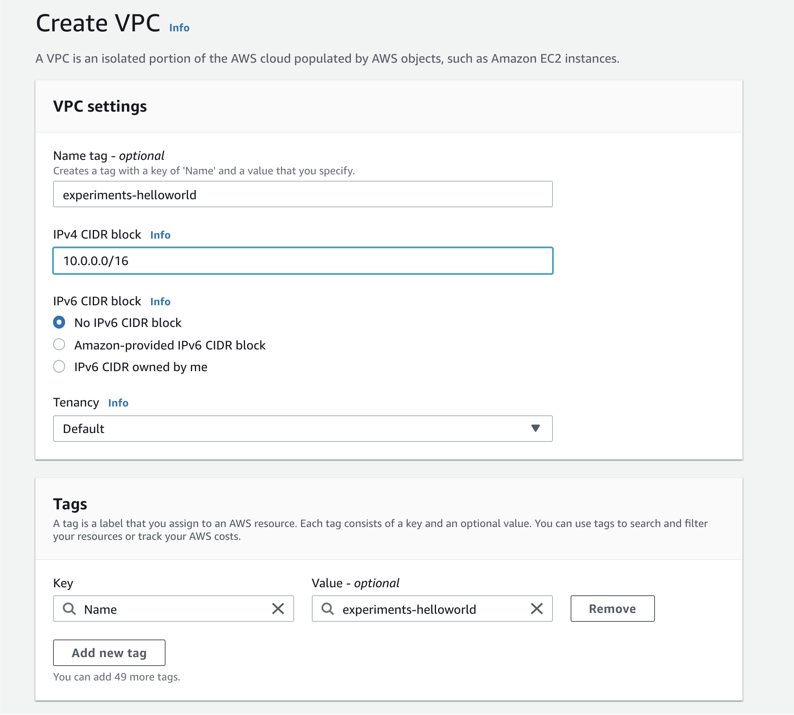
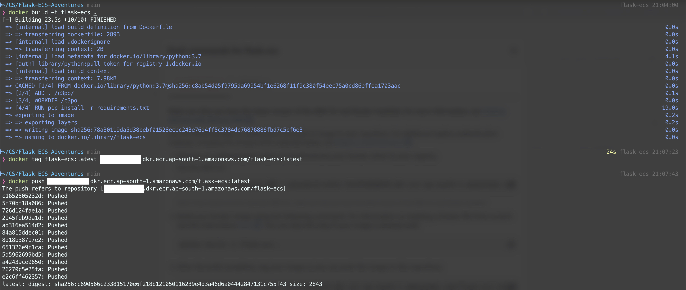

+++
title = "Messing around with AWS for LTTKGP!"
date = 2021-04-20
[taxonomies]
tags = ["LTTKGP", "AWS"]

+++

After hours of minimal success at trying to setup LTTKGP on AWS, I've decided to start over from scratch, with a tiny app and blog my experiments.

**Warning:** This is my first time using AWS beyond just plain old EC2 and S3 and I apologise for any mistakes. Also, this might get really long. you've been warned :)

# Prelude

Last summer, I started working on [LTTKGP](https://lttkgp.com) with a bunch of awesome people. LTTKGP fetches songs posted on the FB Group [Listen To This KGP](https://www.facebook.com/groups/lttkgp), collects metadata, organizes them into feeds, and has a pretty cool webplayer that lets user play these collections. The project is open source and code can be found on the [GitHub org](https://github.com/lttkgp).

LTTKGP has a couple of components, and we use AWS to deploy 2 major services

- **R2-D2**: This is the “Facebook connector” that polls the Facebook group at a pre-defined interval and persists the Graph API response in a No-SQL database. This data is then sent one at a time to C-3PO. The NoSQL database of choice is Amazon AWS’s DynamoDB
- **C-3PO**: The central API server powering the website. C-3PO builds on top of the above projects by listening to new posts coming in from R2-D2, fetching metadata, and storing in a relational database. The website essentially make calls to C-3PO to fetch data and then C-3PO checks its databases, filters and returns songs in a specific format. The database of choice is PostgresQL on AWS RDS

The other major service is Falcon, the beautiful UI that brings it all together. Falcon is deployed on Netlify and we use Cloudflare to manage DNS for the entire project

# Existing AWS Infrastructure

To deploy LTTKGP, [Naresh](https://github.com/ghostwriternr) came up with a pretty cool architecture (and daunting looking :P) which we've been using to deploy, for a couple of months now

 A top level overview is as follows:

- All resources lie inside our VPC, which is the big container.
- There are 2 databases -> DynamoDB, a NoSQL database that stores raw FB posts when R2-D2 fetches them and a Postgres RDS instance to store posts after C-3PO processes them.
- We upload docker images for both C-3PO and R2-D2 to ECR and create task definitions using those images. Task definitions are essentially recipes for the actual services that will run those containers.
- Both C-3PO and R2-D2 have their private and public subnets. The ECS services run inside the private subnets. Security groups control which ports are exposed in each of the subnets, and ensure that private subnets can be accessed only by resources inside of the VPC (and have proper access)
- The Application Load Balancers (ALBs) redirect traffic from the outisde world to C-3PO and R2-D2. We need a NAT Gateway since both services are inside their private subnets and can't access/be accessed on the internet. This also means that routing tables and target groups have to be configured, using the EC2 dashboard

(When this was set up, all I did was stare at the screen in constant awe!)

The major issue with the present infra is that it's pretty expensive mainly because of the NAT Gateway and using Fargate to manage instances, instead of self managing EC2 instances.

# Mirroring Existing Infra

Since we could make do without private subnets, by having tighter rules in our security groups, I attempted to replicate the present infra on my personal AWS account and mess around with it till I can get it working again.

The first thing I did was exactly replicate the infra we were using. It took me a couple hours but I set it up and can be accessed at:

- **C-3PO**: https://api.metamehta.in/
- **R2-D2:** https://data.metamehta.in/
- **Falcon: **https://musik.metamehta.in/

# Experiments!

I found a couple of cool Medium blogs ([One][1], [Two][2]) that descibe how to deploy to ECS using self-hosted EC2 instances but I wasn't able to get C-3PO up and running. I've now decided to start from scratch, with a simple Flask app

## Starting from Scratch - Part 1

The first step is creating a new VPC for our use.

I'll create 2 new subnets inside the VPC. To use a elastic load balancer, we'll need atleast 2 subnets in different availability zones:

- helloworld-public-1: CIDR 10.0.2.0/24 in ap-south-1a
- Helloworld-public-2: CIDR 10.0.4.0/24 in ap-south-1b

I also create a route table, with both of these subnets and a internet gateway that is attached to our VPC. Next, I'll setup a new flask application, dockerize it and create an ECS cluster.

## Creating our test Flask app

To begin, I'll use a simple hello world app. I'll keep iterating if I'm able to successfully deploy this first

Here's the repository: https://github.com/mukul-mehta/Flask-ECS-Adventures

### Step 1: Pushing the image to ECR

I've created a new private repository on AWS ECR called `flask-ecs`, to which I'll push my image. Once I'm done logging in, I build, tag and then push the image to the repository

[1]: https://medium.com/swlh/how-to-deploy-an-application-to-aws-using-docker-ecs-and-ecr-aa7785fc9667
[2]: https://medium.com/swlh/deploying-a-dockerised-web-app-using-aws-elastic-container-service-ecs-8373ec9681d2

