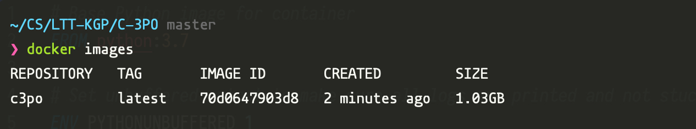
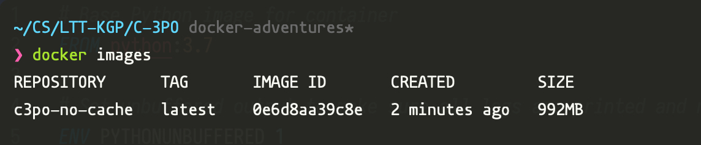
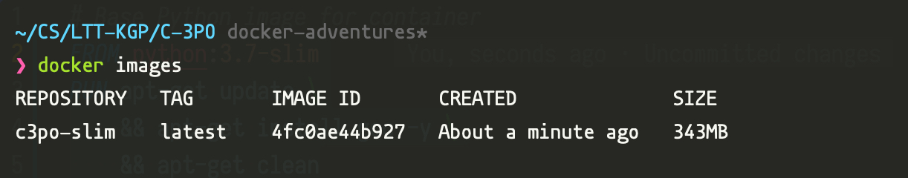

+++
title = "Reducing Docker container sizes for Python apps"

date = 2021-04-29
[taxonomies]
tags = ["Docker", "Python"]
+++


Over the past couple days, I was working on AWS infra for LTTKGP (I've written a [blog](https://metamehta.in/posts/aws-experiments/) about it). One of the major services, C-3PO is built with Flask-REST, and we use Docker to deploy it (Using AWS ECS).

The image that we use takes some time to build and push to AWS ECR. I had to do this a couple of times and it was quite frustrating to wait. I googled a couple ways to reduce the size of the container and tried some of them

To begin with, here's our original image. It's based on Python 3.7, and we cache dependencies when installing with `pip`. The container is 1.03 GB in size, and takes around 195 seconds to build, on my laptop.



## Attempt #1: Disable pip's dependency caching

Using the `--no-cache-dir` flag, we can disable caching dependencies installed via pip. This should reduce the size by a couple MBs atleast. Since the cache is useless inside the container, this has no unintended side-effects.



The size reduced by 38 MB or so, yaaay I guess

## Attempt #2: Using python-slim as base image

Right now, we're using `python:3.7` as our base image. This image is based on Debian Buster (Debian 10), and comes with a ton of packages, most of which we do not need. We could use `python:3.7-slim` as our base image, it contains only the packages needed to run python (it's still based on Debian)

There's 2 caveats though:

1. We use uWSGI, which needs GCC and glibc during installation, and we need to install those via `apt`
2. To install the `psycopg2` package, we need `pg_config`. To avoid installing it from source, we install the `'psycopg2-binary` package instead

```dockerfile
FROM python:3.7-slim
RUN apt-get update \
    && apt-get install gcc -y \
    && apt-get clean
```



Damn, we're down to 343MB. It took around 100 seconds to build, which is half the time to build the original image. Since we haven't made any changes to our python app as such, I expect it to run properly. I tried hitting a couple endpoints manually (obviously a pretty crude way of testing) and it works alright!

#### Using Alpine as base

We could use `python:3.7-alpine` as a base image for our container. Alpine is a lightweight distro, that is very popular with containers. It ships with musl and busybox, instead of glibc and GNU coreutils. I did read on a couple places though that unless space is a major constraint, it's not a great idea to use alpine as a base image for python apps, since all wheels don't build, and there are issues with debugging

Also, uWSGI needs glibc to install by default. There are ways to install it using musl but I'll need to try those. There's also other issues, `psycopg2` needs to be built from source etc

For now, I'm not trying the alpine base image

## Attempt #3: Multistage builds

TBD