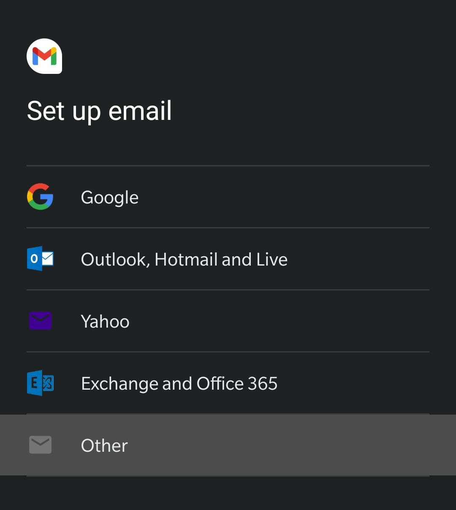
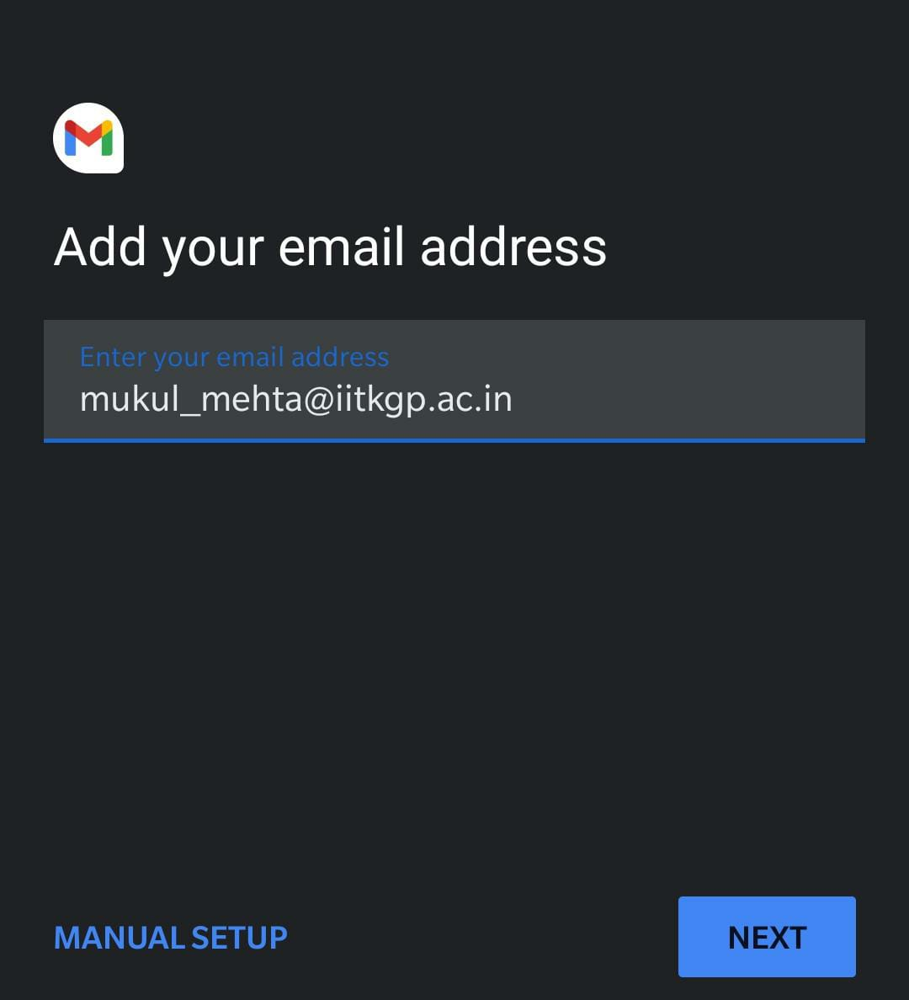
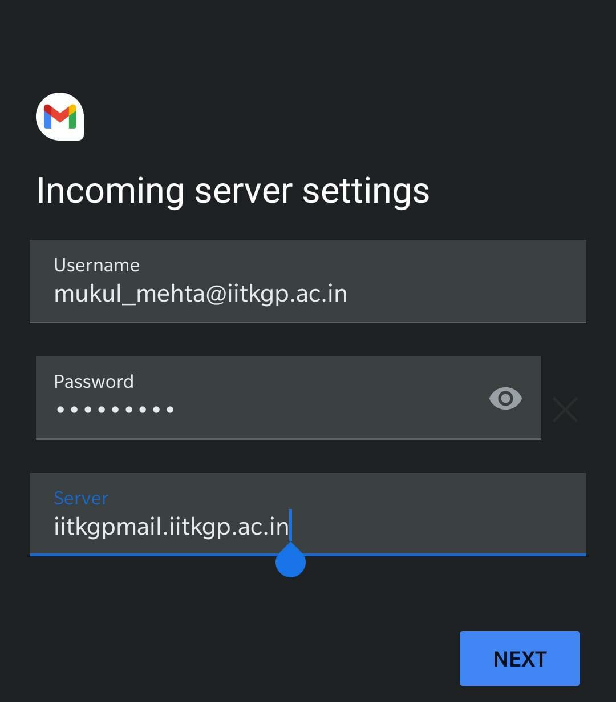
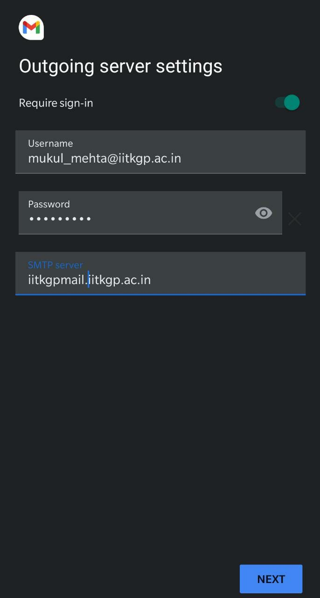

+++
title = "Adding KGP Email to other mail clients"
date = 2021-03-25
[taxonomies]
tags = ["KGP"]
+++


Not really a TIL but a talking to a friend made me realize that it might be better to write a short guide on adding KGP Email (@iitkgp.ac.in) to other mail clients that suck less than Zimbra (Pretty low bar, I know!)

# Why?

All of us get a institute email ID that we can use to send/receive official mail. The mail client we use by default is Zimbra, which looks pretty bad, does not have formatting options and has no way to organize mail


The Computer & Informatics Centre website lists the SMTP and POP/IMAP server for sending and receiving mail, which can be used to add KGP Email to other mail clients. The details can be found at [http://www.cic.iitkgp.ac.in/?q=Mail](http://www.cic.iitkgp.ac.in/?q=Mail)


I've added my institute email ID to the Gmail client on my phone and Apple Mail on my laptop (Which I've recently started to use, and like). I've used Mailspring in the past and really like it


### On the Gmail client on Android

1. Go to add a new account, and choose Other

    


2. Add your email address and then choose manual setup

    


3. In incoming server settings, choose IMAP (Or POP3, I'm using IMAP because it's a more modern protocol). Then add your password and the server will be `iitkgpmail.iitkgp.ac.in` 

    


4. Similarly, for outgoing server, enter your password. The mail server would be `iitkgpmail.iitkgp.ac.in`

    


5. Change additional settings as needed, for sync frequency and notifications. Add the email ID and it should take a couple of minutes to sync old mails. Now you can receive and send emails using this account!


### On other mobile/desktop mail clients

The process should be pretty similar -> Add a custom email, use the credentials that you would use on Zimbra and use `iitkgpmail.iitkgp.ac.in` as the mail server, for both incoming (IMAP/POP3) connections and outgoing SMTP connections


### Configuring Mutt

For some of us more cultured freaks out there, who prefer _minimal_ TUI clients such as mutt, the configuration is pretty similar. Here's my very basic `.muttrc` that I use with my institute email

```ini
set ssl_force_tls = yes
set abort_nosubject = no

set sleep_time = 0
set mail_check = 60
set timeout = 10
set sort = "reverse-date-received"
set copy = no

set from = "mukul_mehta@iitkgp.ac.in"
set realname = "Mukul Mehta"

# Imap settings
set imap_user = "mukul_mehta@iitkgp.ac.in"
set imap_pass = "HAHAHAHAHAHA"

# Smtp settings
set smtp_url = "smtps://mukul_mehta@iitkgpmail.iitkgp.ac.in"
set smtp_pass = "HAHAHAHAHAHA"

# Remote email folders
set folder = "imaps://iitkgpmail.iitkgp.ac.in/"
set spoolfile = "+INBOX"

bind pager <up> previous-line
bind pager <down> next-line
set smart_wrap
```


